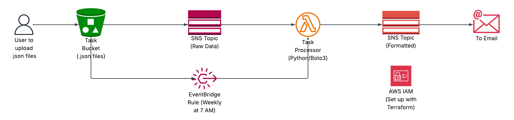

### AWS Project: Serverless Task Notifier

# Overview

This is an automated, event-driven task notification system built on AWS. It started as a no-code concept to be done using PartyRock through just prompts, but I decided to level it up into a more practical and professional cloud solution using Terraform for infrastructure provisioning and Python (Boto3) for the backend logic. The system ensures that weekly task lists are processed and delivered to the user's inbox every Monday morning or upon manual file uploads to S3.

# Architecture Diagram

# Challenges Faced

1) Solving the "Raw Data" Loop: Initially, the system sent raw S3 JSON directly to the user. I solved this by implementing a Python Lambda function to act as a translator. To prevent a recursive loop, I decoupled the architecture into two SNS topics: one for raw input and one for formatted output going to the email.

2) Handling Multi-Trigger Logic: Integrating both S3 events and EventBridge schedules caused the Lambda to crash because the triggers provide different data structures. I updated the code with safety checks to identify the event source, ensuring the system remains stable regardless of how it is triggered.

3) Managing the Infrastructure with Terraform: Building the entire stack as Infrastructure as Code (IaC) required managing complex dependencies, such as ensuring SNS Topic Policies were correctly configured before S3 could send notifications.

4) (Minor) Lambda Deployment Debugging: Faced an ImportModuleError during deployment due to incorrect file zipping and missing dependencies. I resolved this by refining the Terraform archive_file logic and ensuring the boto3 client was correctly initialized within the Lambda handler.

# What's next

What's been completed so far is Phase 1... Phase 2 is upcoming, and this comprises of an update such that I can have notes on my phone where I add tasks which securely upload directly to the S3 file, which then gets sent to the weekly task notifier.

# Phase 2

...